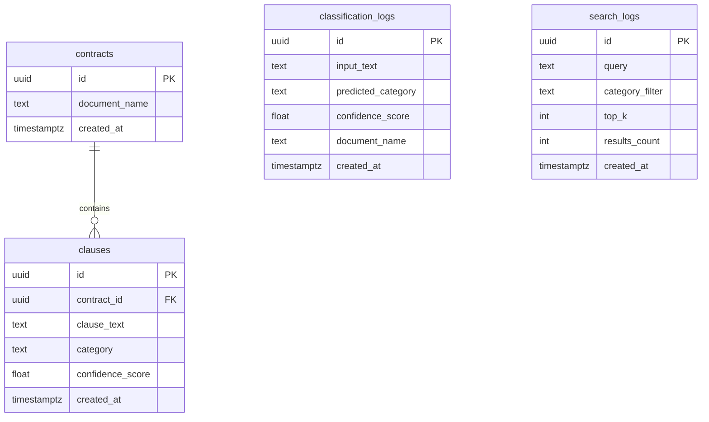

# ClauseIQ Database Documentation (Supabase PostgreSQL)

## 1. Overview
ClauseIQ uses **Supabase PostgreSQL** as its relational metadata and analytics persistence layer for Sprint 3. The database stores uploaded contract metadata, extracted clauses with their predicted ML categories and confidence scores, and audit/telemetry logs for both clause classification and semantic search queries.

---

## 2. Supabase Project Setup

1. **Create Project**:
   - Log in to [Supabase](https://supabase.com).
   - Click **New Project** and specify project name (e.g., `clauseiq-prod`), database password, and preferred region.

2. **Execute Schema SQL**:
   - Open the Supabase dashboard for your project.
   - Navigate to the **SQL Editor** on the left navigation panel.
   - Paste the contents of `database/schema.sql`.
   - Click **Run** to execute the script and create all tables, indexes, and Row Level Security (RLS) policies.

3. **Retrieve Credentials**:
   - Navigate to **Project Settings** → **API**.
   - Copy **Project URL** (e.g., `https://xyzcompany.supabase.co`).
   - Copy **Project API Key** (`anon` or `service_role`).

---

## 3. Environment Configuration

Set the following environment variables in your environment or `.env` file:

```bash
# Supabase Configuration
SUPABASE_URL=https://your-project-id.supabase.co
SUPABASE_KEY=your-anon-or-service-role-key

# Optional CORS configuration
CORS_ORIGINS=http://localhost:3000,http://localhost:5173,http://127.0.0.1:3000,http://127.0.0.1:5173
```

### Graceful Fallback (Offline Mode)
If `SUPABASE_URL` and `SUPABASE_KEY` are not set in the environment:
- The FastAPI backend detects the absence of credentials during startup.
- All ML classification and search endpoints continue to function at 100% capacity in **offline/local mode**.
- Database write operations gracefully log an informational message without raising exceptions or breaking client requests.

---

## 4. Tables and Schema Architecture



### 1. `contracts`
Stores metadata about uploaded legal documents.
- `id` (UUID, Primary Key): Unique contract identifier.
- `document_name` (TEXT): Name of uploaded PDF or text file.
- `created_at` (TIMESTAMPTZ): Upload timestamp.

### 2. `clauses`
Stores individual clauses extracted from uploaded contracts alongside their ML classification.
- `id` (UUID, Primary Key): Unique clause record identifier.
- `contract_id` (UUID, Foreign Key): References `contracts(id)` with `ON DELETE CASCADE`.
- `clause_text` (TEXT): Extracted sentence/clause text.
- `category` (TEXT): Predicted CUAD legal category (one of 41 classes).
- `confidence_score` (DOUBLE PRECISION): True model probability from `predict_proba()`.
- `created_at` (TIMESTAMPTZ): Insertion timestamp.

### 3. `classification_logs`
Audit log for `/classify` requests.
- `id` (UUID, Primary Key): Unique log entry ID.
- `input_text` (TEXT): Input clause text (truncated to 4,000 chars for safety).
- `predicted_category` (TEXT): Predicted CUAD category.
- `confidence_score` (DOUBLE PRECISION): Output probability.
- `document_name` (TEXT, Optional): Source document if originating from file upload.
- `created_at` (TIMESTAMPTZ): Timestamp.

### 4. `search_logs`
Audit log for `/search` requests.
- `id` (UUID, Primary Key): Unique log entry ID.
- `query` (TEXT): Search query string.
- `category_filter` (TEXT, Optional): Category filter applied.
- `top_k` (INTEGER): Number of requested results.
- `results_count` (INTEGER): Actual number of results returned.
- `created_at` (TIMESTAMPTZ): Search timestamp.

---

## 5. Security & Privacy Constraints

1. **No Raw PDF File Storage**: Uploaded binary PDF files are parsed in-memory using PyMuPDF and discarded immediately. They are never saved to Supabase Storage or persistent file systems.
2. **Data Truncation**: Inputs are bounded before insertion to prevent denial-of-service storage exhaustion.
3. **Row Level Security (RLS)**: Enabled across all four tables with explicit read/insert access policies.

---

## 6. How the Backend Connects

The backend connects via `api/services/supabase_service.py`:
- `get_supabase_client()` initializes a lazy singleton client using the official `supabase-py` SDK.
- Non-blocking wrapper functions (`log_classification`, `log_search`, `save_contract_and_clauses`) execute queries asynchronously and safely capture any connection timeouts.
